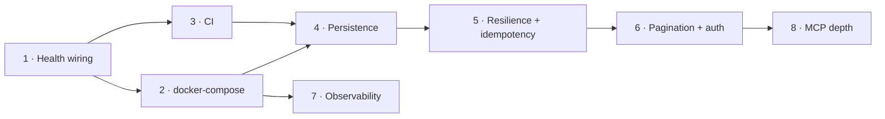

# Extension Implementation Plan — Beyond the Lab Exercises

**Goal:** take the three lab-built services (plus the new `mcp_server`) from "works on one machine, in memory,
run by hand" to something that persists data, runs as a unit, and is verified automatically on every change —
without rewriting the REST contracts already agreed in [api-design.md](sdlc/api-design.md) and the
[README](../README.md) endpoint tables.

The phases below are ordered so each one is independently shippable and verifiable. Phases 1–3 are
infrastructure that pays for itself immediately; Phases 4–6 change runtime behavior and need the safety net
that 1–3 provide, so they must not be started first. Phases 7–8 are quality-of-life work that is deferrable
without blocking anything else.

## Current state

| Area | Today |
| --- | --- |
| Storage | SQLAlchemy-backed SQLite databases with persistent container volumes |
| Running as a unit | Root Compose configuration starts the three APIs with health-gated dependencies |
| CI | GitHub Actions runs Ruff and each isolated pytest suite |
| Readiness | `GET /health` is tested, documented, and used by Compose and MCP integration probes |
| Upstream resilience | Bounded GET retries, validated responses, and persistent idempotency for inventory adjustments and order creation |
| Auth | API key required on resource routers; `/health` remains open |
| Observability | Structured JSON logs and propagated `X-Request-ID` correlation |
| MCP | Eleven tools plus `products://catalog`, pagination, and structured upstream errors |

## Phase 1 — Put the existing health endpoints to work ✅ implemented

This was the smallest useful change and a prerequisite for both compose healthchecks (Phase 2) and CI service startup
(Phase 3). **This was not a "build `/health`" phase** — `health_check()` was already defined in
[product](../services/product_service/app/main.py), [inventory](../services/inventory_service/app/main.py),
and [order](../services/order_service/app/main.py) `main.py`, each returning `{"status": "ok"}` under a
`health` tag. The gap was that nothing depended on them.

- Add a `test_health_returns_200` case to each service's existing test module so a refactor that breaks a
  health endpoint is caught before compose healthchecks fail.
- Switch [conftest.py](../services/mcp_server/tests/conftest.py)'s `_wait_until_ready` from `/openapi.json`
  to `/health`. The current probe works only because FastAPI happens to serve OpenAPI — incidental behavior
  standing in for a readiness endpoint that was there all along.
- Add `/health` to the README's per-service endpoint tables.

**Verify:** `pytest` green in all four suites; MCP integration tests still pass against the new probe.

## Phase 2 — `docker-compose.yml` at the repo root ✅ implemented

Each service was already containerized in isolation; this phase composed them.

- One service block per API (`product`, `inventory`, `order`), each `build:`ing its existing
  `services/<name>/Dockerfile`, publishing its README port.
- `order` gets `PRODUCT_SERVICE_URL=http://product:8001` and `INVENTORY_SERVICE_URL=http://inventory:8002`
  — the env vars [config.py](../services/order_service/app/config.py) already reads, so **no code change is
  required**, which is the test of whether that config module was factored correctly.
- `depends_on` with `condition: service_healthy`, wired to Phase 1's `/health` via compose `healthcheck`.
- Leave `mcp_server` out of compose: it's a stdio process launched by an MCP client
  ([.vscode/mcp.json](../.vscode/mcp.json)), not a long-running networked service. Containerizing it would
  invent a transport the server doesn't currently speak.

**Verify:** `docker compose up`, then `POST /products` → `POST /inventory` → `POST /orders` against the
published ports, and confirm the order reduces stock across container boundaries.

**Verified:** `docker compose up -d --build` was run from the repo root and the full cross-container flow
below completed — see [Docker verification](#docker-verification-completed).

## Phase 3 — CI workflow ✅ implemented

The repository previously had no workflow under `.github/workflows/`.

- Add `.github/workflows/ci.yml` running on push and PR.
- Job 1 — lint: `ruff check .` and `ruff format --check .` from the repo root, using the existing
  [ruff.toml](../ruff.toml) (`line-length = 110`, `target-version = "py314"`).
- Job 2 — test: a matrix over `product_service`, `inventory_service`, `order_service`, `mcp_server`, each
  installing its own `requirements.txt` and running `pytest` from its own directory. The matrix mirrors how
  the services are actually isolated; a single flat `pytest` run from the root would break, because all four
  services expose a top-level package named `app` and would shadow one another.
- Pin the runner to the Python version in `ruff.toml`'s `target-version`, so lint and runtime agree.

**Verify:** a deliberately failing test and a deliberate lint violation each turn the workflow red, then are
reverted.

## Phase 4 — Persistence ✅ implemented

The point where the `docs/database-schema.sql` design artifact stops being illustrative.

- Introduced SQLAlchemy 2.0 (`Mapped`/`mapped_column`) models per service in a new `app/db.py`, backed by
  SQLite (see deviation below).
- **Repository classes stayed the seam, unchanged in signature.** `ProductRepository`,
  `InventoryRepository`, and `OrderRepository` kept every method name and return type; only their bodies
  now talk to a SQLAlchemy session instead of a `dict`. Route handlers in all three services required
  **zero changes** — confirming the abstraction held.
- ORM column names mirror the Pydantic field names exactly (`productId`, `lastUpdated`, etc.) rather than
  snake_case, so `Model.model_validate(row, from_attributes=True)` works with no extra mapping layer.
- Each test module's `clear()`-based `autouse` fixture is untouched — `clear()` now means
  `Base.metadata.drop_all(engine)` + `create_all(engine)` instead of `dict.clear()`, so the fixture, and
  every existing test, needed no edits at all.
- **Atomicity preserved as planned.** `InventoryRepository.update`'s delta path is a single
  `UPDATE inventory SET quantity = quantity + :delta ... WHERE productId = :id AND quantity + :delta >= 0`
  — the accept/reject decision is made by the database in one statement, not by a Python read-then-write.
  A `0`-rowcount result (item exists but the guard failed) raises `InsufficientInventoryError`, same as before.
- Test isolation: Product tests use `sqlite:///:memory:` with `StaticPool`; Inventory and Order tests use
  disposable file-backed SQLite databases so concurrency tests exercise separate connections. The MCP
  integration subprocesses use isolated in-memory databases.

**Deviations from the original plan, and why:**

- **SQLite, not Postgres-in-compose.** The connection is fully abstracted behind `DATABASE_URL`
  (`app/db.py` picks SQLite-specific `connect_args`/`poolclass` only when the URL starts with `sqlite`), so
  swapping to Postgres later is a URL + driver-dependency change, not a repository rewrite. Doing that swap
  now would have added a Postgres image, a driver dependency, and connection-pool tuning to this pass without
  changing what's actually being validated (the repository seam and the atomic-delta guarantee). Deferred to
  whenever real concurrent load makes SQLite's single-writer model the actual bottleneck.
- **Alembic deferred, `create_all()` used instead.** There is no pre-existing migration history — the first
  Alembic revision would just be "create these tables," which `create_all()` already does correctly and with
  far less scaffolding (no `alembic.ini`/`env.py`/`versions/` per service). Alembic earns its cost the first
  time a schema changes under running data; add it then, not preemptively.
- **`docker-compose.yml` mounts named volumes** (`product-data`, `inventory-data`, `order-data`) at `/data`
  with `DATABASE_URL=sqlite:////data/<service>.db`, so container restarts don't lose data — this was implied
  by "persists data" in the plan's own goal statement even though the original Phase 4 text didn't call it
  out explicitly.

**Verified:** the inventory suite includes a barrier-synchronized concurrent-request test that applies
parallel `PATCH` deltas and asserts the final quantity equals the initial quantity plus every successful
delta. Test databases use a disposable file-backed SQLite database so concurrent requests use independent
connections without risking external data.

## Phase 5 — Cross-service resilience ✅ implemented

This phase hardened [clients.py](../services/order_service/app/clients.py), which previously had one timeout and no retry.

- Add bounded retry with exponential backoff for `GET` calls to Product and Inventory (idempotent, safe to
  retry).
- **Do not blanket-retry the inventory `PATCH`** — it is not idempotent; a retried delta double-decrements
  stock. Instead, add an idempotency key: `POST /orders` accepts an `Idempotency-Key` header, the Order
  Service forwards it on the adjustment, and Inventory Service records applied keys and returns the prior
  result for a repeat. This is the correct fix for the retry-safety gap and should be designed as its own
  slice, not bolted onto the retry change.
- Replace the `KeyError`-catch on `inventory["quantity"]` / `product["price"]` with a Pydantic response model
  per upstream call, so a contract drift fails with a precise validation error rather than a missing-key
  guess.
- Add circuit-breaker-style short-circuiting only if retries prove insufficient — not up front.

Implemented with three bounded `GET` attempts and 0.1s/0.2s exponential delays. Product and Inventory
responses are validated through `UpstreamProduct` and `UpstreamInventory` Pydantic models. Inventory
persists successful delta keys and their response snapshots; exact replays return the snapshot, while key
reuse for a different product or delta returns `409`. Inventory `PATCH` remains single-attempt. Order
creation persists the caller key, canonical request identity, and created order, while forwarding
`order-create:{caller_key}` to Inventory. Cancellation uses `order-cancel:{order_id}`, so creation and
cancellation keys cannot collide and ambiguous responses remain safe to retry.

## Phase 6 — Pagination and auth ✅ implemented

Last, because both change the public contract.

- **Pagination:** `GET /products`, `/inventory`, `/orders` previously returned unbounded lists. Add `limit` and
  `offset` query params with sane defaults and a `422` on out-of-range values (via `Query` constraints, per
  the repo's "validation lives in Pydantic/`Field`, not `if` blocks" rule). Update the MCP `list_*` tools to
  pass them through, otherwise the MCP layer silently truncates once defaults apply.
- **Auth:** an API key dependency applied per router. This originally contradicted the documented decision
  in [copilot-instructions.md](../.github/copilot-instructions.md) that authentication was out of scope. **Resolution:** the instructions file
  is edited in the same commit as the first authenticated router, rewriting that line to state which paths
  require credentials and that `/health` stays open (compose and CI probe it unauthenticated). Landing the
  code without the doc edit is what leaves the repo's conventions arguing with its code, so the two are one
  change, not two.
- `/health` is explicitly excluded from auth — Phase 2's compose healthcheck and Phase 3's CI startup both
  poll it before any credential exists.

Implemented with `limit=50` and `offset=0`; limits outside `1..100` and negative offsets are rejected by
FastAPI with `422`. Repositories apply deterministic SQL ordering before `OFFSET`/`LIMIT`: product id,
inventory product id, and order creation time plus id. MCP list tools expose the same parameters and pass
them through to the REST services.

Each resource router uses the same `X-API-Key` dependency contract, configured through `API_KEY`, while
`/health` remains outside those routers and unauthenticated. The local-only default
`local-development-api-key` is explicit in compose and the VS Code MCP config. Order Service forwards the
key on all Product and Inventory calls, and the MCP HTTP client sends it on every service call. Authentication
failures return `401` without logging or returning the configured key.

**Verified:** product (17), inventory (26), order (51), and MCP server (15) tests pass; repo-wide
`ruff check .` and `ruff format --check .` are clean.

## Phase 7 — Observability ✅ implemented

Only worth doing once Phase 2 makes the services run as a unit, because the problem it solves — "which of the
three failed?" — doesn't exist while you're starting them by hand in three terminals.

- Structured JSON logging replacing `logging.basicConfig(level=logging.INFO)` in
  [order_service/app/main.py](../services/order_service/app/main.py), and added to the other two, which
  previously configured no logging.
- **Correlation IDs.** Accept an `X-Request-ID` header, generate one when absent, attach it to every log line,
  and have [clients.py](../services/order_service/app/clients.py) forward it on both upstream calls. Without
  this, a failed `POST /orders` produces three unrelated log streams with no way to join them — which is the
  main thing that makes the current `502`-passthrough hard to debug.
- Keep the existing `logger.error` call sites; they already log at the right boundaries (upstream timeout,
  non-2xx, malformed response). This phase changes the *format and linkage*, not the placement.

Implemented with a per-service JSON formatter and request middleware backed by `ContextVar`. Every request
accepts or generates `X-Request-ID`, returns the effective value, and emits a request-completion record with
the same ID. The formatter adds that context to existing application log records, including the existing
Order Service `logger.error` boundaries. Logged request metadata is limited to method, path, and status;
headers, query values, and bodies are excluded so API keys and body secrets are not captured.

Order Service reads the context-local ID when building every Product/Inventory request and forwards it on
all retried `GET` attempts and single-attempt Inventory `PATCH` calls. Context-local storage prevents one
concurrent request from overwriting another request's correlation ID.

**Verified:** focused tests cover supplied and generated IDs, response headers, JSON fields,
credential/body exclusion, concurrent-request isolation, and forwarding on Product `GET`, Inventory `GET`,
and Inventory `PATCH`. Full API suites pass — product (20), inventory (29), order (56) — and repo-wide
`ruff check .` / `ruff format --check .` are clean. Container log inspection was initially skipped because
Docker was unavailable; it was completed later in the [Docker verification](#docker-verification-completed)
run, where one `X-Request-ID` was observed across all three containers' JSON logs.

## Phase 8 — MCP server depth ✅ implemented

The [MCP server](../services/mcp_server) originally exposed 11 tools and no resources.

- **Expose resources, not just tools.** A read-only `products://catalog` resource lets a client load the
  catalog as context without spending a tool call per lookup. Tools are for actions with side effects
  (`create_order`, `adjust_inventory`); reads that an agent wants ambiently are a better fit for resources.
- **Granular errors.** Every failure previously collapsed to a `RuntimeError` via `_call` in
  [main.py](../services/mcp_server/app/main.py), so a client cannot distinguish "product not found" (user
  error, retry with different input) from "inventory service down" (infrastructure, retrying won't help).
  `UpstreamError` already carries `service` and `detail` — surface them.
- **Pagination passthrough** once Phase 6 lands, or the `list_*` tools silently truncate at whatever default
  limit the services adopt.
- **Pin the MCP major version.** [requirements.txt](../services/mcp_server/requirements.txt) says `mcp>=2.0`;
  the v1→v2 rename (`FastMCP` → `MCPServer`) already broke the first implementation attempt of this server, so
  an unbounded upper range will break it again on v3. Change to `mcp>=2.0,<3`.

**Verify:** existing integration tests still pass; add cases asserting a missing product and a downed service
produce distinguishable error types.

Implemented `products://catalog` as a static read-only `application/json` resource. A read walks the Product
Service collection in 100-item pages until exhausted, using the existing `EcommerceClient.list_products`
path so API-key authentication and pagination behavior remain shared with the tools. Read operations remain
available as tools for targeted calls; action tools are unchanged.

`UpstreamError` now preserves the HTTP status separately from the service and detail. The MCP boundary maps
anticipated failures to `MCPError` subclasses, which MCP v2 propagates as structured JSON-RPC errors:
`UpstreamNotFoundProtocolError` (`upstream_not_found`, code `-32004`) for `404`,
`UpstreamUnavailableProtocolError` (`upstream_unavailable`, code `-32001`) for transport failures and
upstream `5xx`, and `UpstreamRejectedProtocolError` (`upstream_rejected`, code `-32000`) for other upstream
`4xx` responses. Every error includes stable `data` fields for `type`, `service`, `detail`, and
`status_code`, avoiding message parsing and the former collapse to `RuntimeError`.

Pagination passthrough is covered for all three list clients and all three integration-level list tools, plus
multi-page catalog loading. The MCP dependency is bounded to `mcp>=2.0,<3`.

**Verified:** MCP tests pass (23), including real-service catalog loading, complete catalog pagination,
authenticated pagination passthrough, and distinct missing-resource versus unavailable-service errors.

## Docker verification (completed)

All compose-level verification that was previously deferred due to Docker being unavailable has now been run
locally (`docker compose up -d --build` from the repo root, Docker 29.6.2 / Compose v5.3.1), covering Phase 2's
original verification step plus the runtime behavior of Phases 4–7 in a composed deployment:

- **Health-gated startup (Phase 1/2).** `order` only started after `product` and `inventory` reported
  `service_healthy` via `/health`, confirming `depends_on: condition: service_healthy` is wired correctly.
- **Cross-container E2E (Phase 2's verify step).** `POST /products` (201) → `POST /inventory` (201, qty 100)
  → `POST /orders` (201) against the published ports; the order reduced inventory from 100 to 97 across
  container boundaries, and the order's `unitPrice`/`totalPrice` were read from the Product Service over HTTP.
- **Persistent idempotency (Phase 5).** Replaying `POST /orders` with the same `Idempotency-Key` returned the
  identical order and left stock unchanged. After `docker compose restart`, replaying the same key again
  returned the same order — the idempotency records survived because they live in the named SQLite volumes,
  not in process memory.
- **Pagination + auth (Phase 6).** `GET /products?limit=50&offset=0` with `X-API-Key` succeeded; the same
  request without the key returned `401` with `{"detail":"Invalid or missing API key"}`; `/health` returned
  `200` unauthenticated, as compose healthchecks and CI require.
- **JSON logging + correlation (Phase 7), previously verified only without Docker.** A single
  `X-Request-ID: docker-verify-req-99` on `POST /orders` appeared in the JSON logs of **all three
  containers** — Order's inbound request and its `httpx` outbound log lines to Product and Inventory, plus
  Product's and Inventory's inbound request-completion records — confirming both the JSON format
  (`timestamp`/`level`/`service`/`logger`/`message`/`request_id` fields) and cross-container ID forwarding at
  runtime. Supplied IDs are echoed in the response header, and an absent ID is generated server-side
  (a fresh UUID was observed).
- **Persistence (Phase 4's compose volumes).** After `docker compose restart`, the product, inventory
  (quantity 96), and both orders were still present from the named `product-data` / `inventory-data` /
  `order-data` volumes — container restarts do not lose data.

After verification, `docker compose down` removed the containers and network, keeping the named volumes for
local reuse.

## Sequencing

Phases 1–3 are a single milestone and should land together — they're small, carry no behavioral risk, and
everything after them depends on having CI as a safety net. Phases 4 and 5 are the real work. Phases 6–8 are
independently deferrable.

## Explicitly not doing

- **Playwright / browser-based testing** — there is no UI in this repo; browser automation would test
  FastAPI's generated `/docs` page, not this project's behavior.
- **A shared internal library** for the duplicated `config.py`, health endpoint, and error-mapping code. The
  duplication is the cost of the service isolation the README mandates; removing it would couple deploys.
- **Merging the four services into one app.** They're separately deployable by design, which is the entire
  point of the cross-service HTTP rules in [copilot-instructions.md](../.github/copilot-instructions.md).
- **Message queues / event sourcing for inventory.** The idempotency key in Phase 5 solves the actual
  correctness problem at a fraction of the cost; async eventing is a solution to a scale problem this project
  doesn't have.

## Decisions worth confirming

1. **Repository classes are the persistence seam.** Phase 4 rewrites their bodies only. Route handlers
   changing during a storage swap means the abstraction failed and should be fixed before proceeding.
2. **No shared library across services.** The README's isolation rule (each service standalone, cross-service
   calls over HTTP only) holds — duplicated `config.py`/health-endpoint code across services is the accepted
   cost, not a refactoring target.
3. **`mcp_server` stays out of compose.** It's a stdio MCP process, not a networked service; adding an HTTP
   transport for it is a separate decision, not a side effect of Phase 2.
4. **Retry and idempotency are separate slices.** Shipping retry without idempotency on the inventory `PATCH`
   makes double-decrement *more* likely, not less. If only one can be done, do idempotency.
5. **Auth is contract-breaking and goes last.** It invalidates every existing test's unauthenticated request
   and a documented repo convention; doing it before Phase 3's CI exists would remove the safety net exactly
   when it's most needed.
6. **SQLAlchemy metadata is the schema source of truth.** Each SQLite service bootstraps new databases with
   `Base.metadata.create_all()`, and `docs/database-schema.sql` is maintained only as a current reference to
   those ORM tables. Alembic is deferred until the first intentional schema evolution that must preserve
   deployed data; there is no required initial migration for the current bootstrap-only phase.
7. **The plan's own claims were verified against the code, not the docs.** An earlier draft of this plan
   asserted that `/health` did not exist, because
   [review-findings.md](sdlc/review-findings.md) and the Exercise 2/3 plans discuss it only in passing. It has
   in fact shipped in all three services since Exercise 2. Any future phase that claims something is missing
   should be checked against `services/**` before work is scoped around building it.
