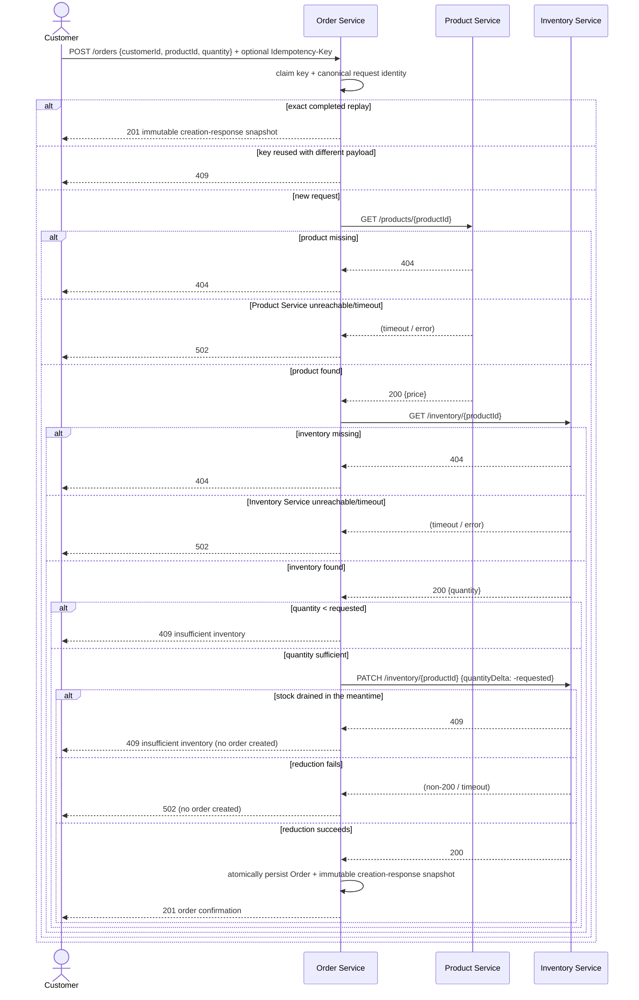
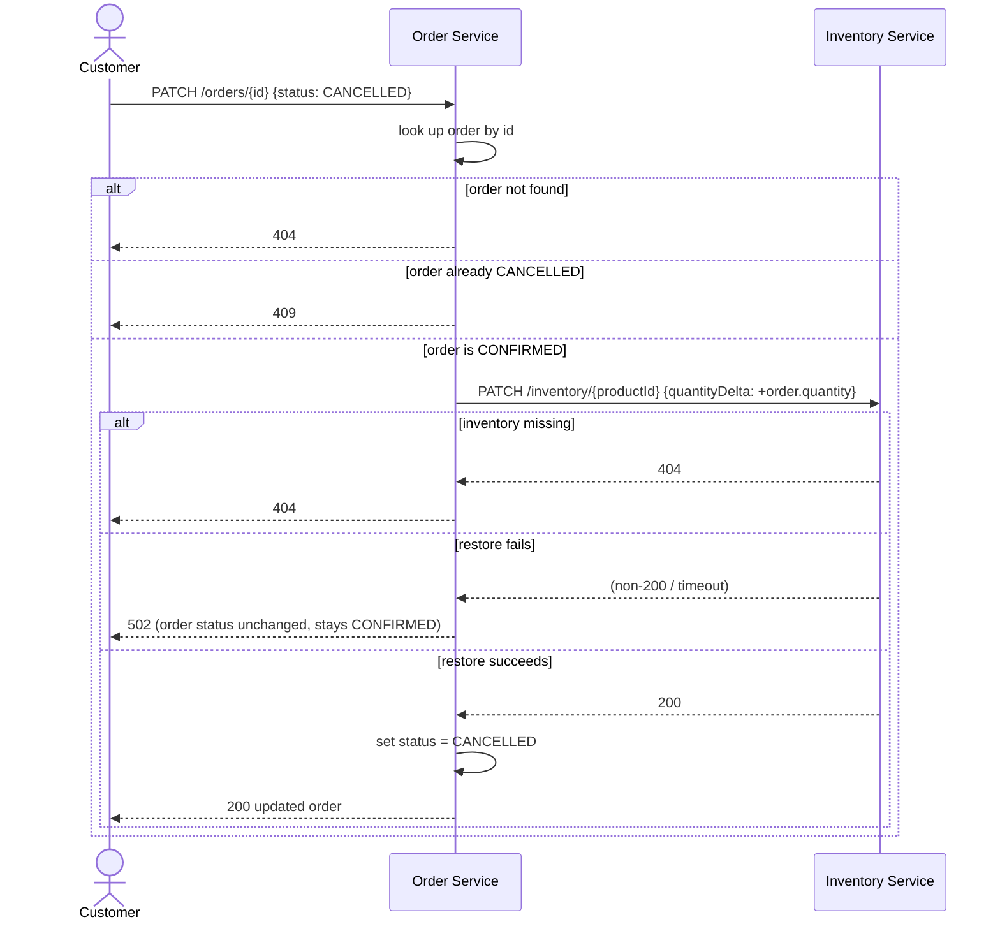

# SDLC Exercise — Sequence Diagrams

**Phase:** Design · **Slice:** Order cancellation
**Input:** [user-stories.md](user-stories.md), [api-design.md](api-design.md)

## Order creation (existing behavior)

## Order cancellation (new slice, US-07)

**Shared property, both flows:** the inventory update is a single atomic `PATCH` carrying a *delta*, not a
read-then-write of an absolute quantity. Inventory Service applies `quantityDelta` to its own stored value
and rejects the call with `409` if that would drive stock below zero, so concurrent creates and cancels for
the same product can no longer overwrite each other. The availability `GET` that still precedes order
creation is only there to produce a friendly pre-flight `409`; correctness rests on the `PATCH`.

Creation sends `order-create:{caller_key}` to Inventory and cancellation sends
`order-cancel:{order_id}`. For keyed creation, Order Service serializes the claim and result write in a
SQLite immediate transaction, so concurrent exact replays observe one persisted order and one inventory
adjustment. Replays read the immutable creation-response snapshot rather than the mutable order row, so a
later cancellation cannot change the original `CONFIRMED` response.

> Earlier revisions of this slice read the current quantity and wrote back an absolute value, which left a
> race window between the `GET` and the `PATCH`. That gap was closed during review remediation — see
> [review-findings.md](review-findings.md).
